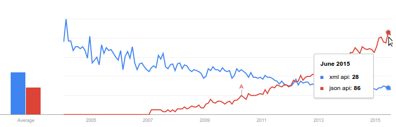

title: REST in peace
author:
  name: Fabien Furet
  twitter: RETFU
  url: http://fabienfuret.net
output: index.html
controls: true
style: assets/style.css
theme: sjaakvandenberg/cleaver-light

--

# REST in peace

-- 

### Qu'est-ce que REST?

* Representational State Transfer
* CRUD HTTP
* Sans état
* Cachable
* Pas un standard mais un style d'architecture
* Utilise des standards

-- 

### Qu'est-ce que REST?

URI = https://api.domain.com/v2/items/5 

Ressource = https://api.domain.com/v2/ **items/5**

Représentation
```json
{
  "id": 7856,
  "name": "Jo",
  "age": 18,
  "isGeek": true
  ...
}
```

-- 

### Qu'est-ce que REST?

Modèle de maturité de Richardson
* Level1: les ressources
* Level2: verbes et code erreurs HTTP
* Level3: hypermédia (HATEOAS)

--

# RTFM

--

### Les Bases

* SSL 
* UTF-8 partout
* Versionner via l'URL: https://api.domain.com/v2
> Max 2 versions en prod sinon c'est ingérable
> <br/>Via Header `Accept: application/json; version=2`

--

### Les Bases

| Type | Description |
| ------------ | ------------- |
| String | Encodée en UTF-8 |
| Integer | Entier signé en 32-bit ou 64-bit |
| Float | Nombre flottant signé en 32-bit ou 64-bit |
| Boolean | true ou false |
| Date | **UTC** et au format **ISO8601**: 2015-07-31T20:00:01Z |

--

# Ressource

--

### Définition

* Toujours au pluriel
* Nommé avec des - ou des _
* Ne reflète pas forcément votre modèle de donnée
* Une ressource = une URI
* Une ressource = plusieurs représentations<br/>(JSON, XML, MessagePack...)

--

### Interactions

| URL | Action |
| ----------------------- | ------------- |
| GET /items | Liste d'item |
| GET /items/1782 | Item 1782 |
| POST /items | Creation d'un nouvel item |
| PUT /items | Mise à jour de plusieurs items |
| PUT /items/1782 | Mise à jour de l'item 1782 |
| DELETE /items/1782 | Suppression de l'item 1782 |

> PATCH devrait être utiliser pour faire des updates partielles à la place de PUT pour être RESTfull.   

--

### Relations

| URL | Action |
| ------------ | ------------- |
| GET /items/1782/comments | Liste de commentaire de l'item 1782 |
| GET /items/1782/comments/56 | Commentaire 56 de l'item #1782 |
| POST /items/1782/comments | Création d'un commentaire pour l'item 1782 |
| PUT /items/1782/comments/56 | Mise à jour du commentaire 56 pour l'item 1782 |
| DELETE /items/1782/comments/56 | Suppression du commentaire 56 pour l'item 1782 |

--

### Actions

On utilise toujours **POST**.

| URL | Action |
| ------------ | ------------- |
| POST /items/1782/translate | Traduit l'item 1782 |
| POST /items/1782/enable | Active l'item 1782 |
| POST /items/1782/comments/56/star | Met en favori le commentaire 56 de l'item 1782 |

--

# Représentation

--

### JSON sinon rien

* JSON uniquement



> Plus personne n'utilise XML sauf dans un contexte grand compte / DSI
> Donc `Accept: application/json; application/xml` mais on garde JSON en choix n°1

* JSON pretty print
* Les ids des représentations sont des UUID

--

### Pas d'enveloppe

```json
{
  "id": 7856,
  "name": "Jo",
  "age": 18,
  "isGeek": true
}
```

Plutôt que

```json
{
  "data": {
    "id": 7856,
    "name": "Jo",
    "age": 18,
    "isGeek": true
  }
}
```

--

### Imbrication

```json
{
  "id": 7856,
  "name": "Jo",
  "age": 18,
  "isGeek": true,
  "country": {
    "id": 569
  }
}
```

Plutôt que

```json
{
  "id": 7856,
  "name": "Jo",
  "age": 18,
  "isGeek": true,
  "country_id": 569
}
```

--

### Imbrication

```http
X-Resource-Nested: true
```

```json
{
  "id": 7856,
  "name": "Jo",
  "age": 18,
  "isGeek": true,
  "country": {
    "id": 569,
    "name": "France",
    "codeISO": "FR"
  }
}
```

--

# Requête

--

### Headers

```bash
$ curl -X POST https://api.domain.com/v2/items \
    -H "Accept: application/json" \
    -H "Accept-Encoding: gzip" \
    -H "Content-Type: application/json;charset=utf-8" \
    -H "If-Modified-Since: Fri, 31 Jul 2015 20:41:30 GMT"
    -d '{"name": "Jo", "age": 18, "isGeek": true}'

{
  "id": 7856,
  "name": "Jo",
  "age": 18,
  "isGeek": true
  ...
}
```

--

### Body

* JSON pour POST, PUT ou PATCH
* Sérialisation identique entre le body requète et réponse
* Passer des représentations complètes ou partielles
* Bénéficier du typage JSON: `Array` `String` `Number` `Object` `Boolean` `Null`

> On peut supporter `Content-Type: application/x-www-form-urlencoded` en parallèle.
> Obligera côter serveur à typer les valeurs manuellement et on n'aura pas de structure de ressource out of box.

--

### Erreurs

| HTTP status code | Information |
| ------------ | ------------- |
| 406 Not acceptable | Format de retour non disponible<br/>(la requête demande du XML alors qu'on ne gère que du JSON) |
| 415 Unsupported Media Type | Content type pas supporté<br/>(on envoie du XML alors qu'on ne suppporte que JSON) |

--

# Réponse

--

### Headers

```http
Content-Type: application/json;charset=utf-8
Content-Encoding:gzip
Content-Length:126444
Last-Modified: Wed, 08 Jul 2015 12:59:49 GMT
X-Request-UUID: 454684315618613
X-Rate-Limit-Limit: 10000
X-Rate-Limit-Remaining: 8532
X-Rate-Limit-Reset: 1200
```

--

### Code HTTP

| HTTP status code | Information |
| ------------ | ------------- |
| 200 Ok | GET, PUT, PATCH et DELETE ainsi que pour POST lors d'une "action" |
| 201 Created | POST lors de la création d'un item |
| 202 Accepted | La requête est ok, mais on la traitera plus tard |
| 204 No Content | DELETE sans body |
| 206 Partial content | Si la réponse ne renvoie pas l'ensemble de la resource (une liste par ex) |

Lors d'un `200 Ok` **on doit retourner la ressource**.

Lors d'un `201 Ok`: retourner la ressource et indiquer l'URI de la nouvelle resource dans le header.  

```http
Location: https://api.domain.com/v2/items/1783
```

--

### Format d'erreur

```json
{
  "code": "error_code",
  "description": "More details about the error here",
  "url": "https://doc.domain.com/api/error/error_code"
}
```

--

### Exemples de format d'erreur

```http
HTTP/1.1 400 Bad Request
```  
```json
{
  "code": "invalid_request",
  "message": "Can't parse the request body, JSON not valid.",
  "url": "https://doc.domain.com/api/error/invalid_request"
}
```
<br/>
```http
HTTP/1.1 422 Unprocessable Entity
```  
```json
{
  "code": "invalid_item",
  "message": "Name is required, isGeek must be a boolean.",
  "url": "https://doc.domain.com/api/error/invalid_item"
}
```

--

### Validation plus fine

```http
HTTP/1.1 422 Unprocessable Entity
```  
```json
[
    {
        "code": "invalid_item_name",
        "message": "Name is required",
        "url": "https://doc.domain.com/api/error/invalid_item_name"
    },
    {
        "code": "invalid_item_geek",
        "message": "isGeek must be a boolean.",
        "url": "https://doc.domain.com/api/error/invalid_item_geek"
    }
]
```

--

### Code HTTP Erreurs

| HTTP status code | Information |
| ------------ | ------------- |
| 400 Bad Request| Requête mal formée (body non parsable etc...) |
| 401 Unauthorized | Authentification invalide |
| 403 Forbidden | Authentication ok, mais on a pas les droits |
| 404 Not Found | Resource pas trouvée (inexistante ou suite à un `DELETE`) |
| 405 Method Not Allowed | Méthode HTTP non autorisée (utilisation d'un `POST` vs `DELETE`) |
| 406 Not acceptable | Format de retour non disponible (requête du XML vs JSON) |
| 415 Unsupported Media Type | Content type pas supporté (on envoie du XML vs JSON) |
| 422 Unprocessable Entity | Tout ce qui touche à la validation |
| 429 Too Many Requests | Trop de requêtes (on a dépassé le rate limit) |
| 500 Internal Server Error | Certainement une coquille dans le code ^^ |
| 503 Service Unvailable | Lors d'une maintenance ou si l'on veut couper l'API |

--

### Pagination: requête

```bash
$ curl -X POST https://api.domain.com/v2/items?page=2&per_page=100 \
    -H "Content-Type: application/json"
    -H "Accept: application/json" \
    -H "Accept-Encoding: gzip" \
    -H "If-Modified-Since: Fri, 31 Jul 2015 20:41:30 GMT"
```

> On pourrait utiliser le header `Range` mais par affordance et pour le côté pratique il vaut mieux utiliser la querystring.

--

### Pagination: réponse

* `206 Partial content` si on n'a pas toutes les ressources, 
* `200 OK` si elles sont toutes retournées

Utiliser le header `Link` pour transmettre la pagination:
```http
Link: <...?page=3&per_page=100>; rel="next",<...?page=1&per_page=100>; rel="prev"
```
> Le client n'aura pas à construire la pagination.
> On peut aussi ajouter la première et la dernière page `rel=first` et `rel=last`.
--

### Pagination: réponse

Ajouter un header custom pour indiquer le nombre totale de ressources disponibles:
```http
X-Total-Count: 456
X-Page-Max-Range: 100
```
Le serveur doit retourner `400 Bad request` si on dépasse les capacités de l'API.

--

### Filtering, sort & search

```bash
$ curl -X GET https://api.domain.com/v2/items?q=toto&isGeek=false
&age=18,19&sort=name,id \
    -H "Content-Type: application/json"
    -H "Accept: application/json" \
    -H "Accept-Encoding: gzip" \
    -H "If-Modified-Since: Fri, 31 Jul 2015 20:41:30 GMT"
```

> q pour une recherche fulltext. On peut aussi se servir des filtres pour faire une recherche sur un champs particulier, exemple name=Marado*

--

### Cache

On envoie le header ```If-Modified-Since``` pour valider que la ressource n'a pas été modifiée. 

Dans ce cas on retourne un [`304 Not Modified`](http://httpstatus.es/304).

Sinon on retourne la ressource avec le header ```Last-Modified```.

> On pourrait utiliser Etag, mais ça nécessite de maintenir un hash de la ressource alors qu'on aura toujours un timestamp de modification.

--

# Must have

--

### Rate limiting

* Limitation des appels vers l'API
* Garder un niveau de qualité/performance
* Eviter les abus
* `429 Too many requests` si on dépasse la limite

| Header | Description |
| ------------ | ------------- |
| X-Rate-Limit-Limit | Le nombre de requête possible pendant la période | 
| X-Rate-Limit-Remaining | Le nombre de requête qu'il reste pour la période |
| X-Rate-Limit-Reset | Le nombre de seconde qu'il reste avant de remettre les compteurs à 0 |

--

### Cross-Origin Resource Sharing (CORS) 

* Api et Webapp sur des domaines différents
* Requête `OPTIONS` (preflighted request)

```bash
$ curl -X OPTIONS https://api.domain.com/v2/items?q=toto&isGeek=false
&age=18,19&sort=name,id \
    -H "Content-Type: application/json" \
    -H "Accept: application/json" \
    -H "Accept-Encoding: gzip" \
    -H "If-Modified-Since: Fri, 31 Jul 2015 20:41:30 GMT" \
    -H "Access-Control-Allow-Methods: GET" \
    -H "Access-Control-Allow-Headers: X-Rate-Limit-Limit, X-Rate-Limit-
    Remaining, X-Rate-Limit-Reset, X-Total-Count, X-Page-Max-Range, X-Request-UUID, X-Resource-Nested" \
    -H "Origin: http://superappjs.com"
```

```http
Access-Control-Allow-Origin: http://superappjs.com
Access-Control-Allow-Methods: GET, POST, PUT, DELETE, OPTIONS
Access-Control-Allow-Headers: X-Rate-Limit-Limit, X-Rate-Limit-Remaining, X-Rate-Limit-Reset, X-Total-Count, X-Page-Max-Range, X-Request-UUID, X-Resource-Nested
```

> IE<10 ne supporte pas correctement CORS, dans ce cas il faudra se tourner vers JSONP

--

### Documentation

* Point clé pour que l'API soit populaire si publique
* Il faut qu'elle soit maintenue et **facile à maintenir**!
* Le mieux c'est que la documentation soit dans le code.
* Mettre des exemples cURL

http://apidocjs.com 
* Annotations dans le code
* Génére la documentation complète de votre API

--

### Aller plus loin

* Authentification
* Test
    * Codeception
    * behat-rest-testing
    * RAML + PHPUnit
    * CasperJS
* Spécification
    * json:api
    * JSON Schema
    * RAML

-- 

# Questions?