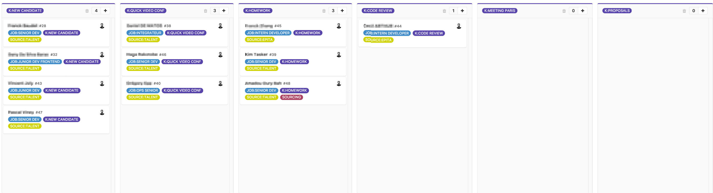

title: Recruter vos developpeurs
author:
  name: Fabien Furet
  twitter: RETFU
  url: http://fabienfuret.net
output: index.html
controls: true
style: assets/style.css
theme: sjaakvandenberg/cleaver-light

--

# Recruter vos **developpeurs**
## Retour d'expérience

--

### Contexte IWD

* SaaS dans le merchandising/marketing, grand compte
* ~70 collaborateurs dont ~16 dans l'équipe dev
* Paris, New York, Singapore, Los Angeles, Bordeaux, Caen et Lyon
* Forte volonté d'augmenter les effectifs et particulièrement dans l'équipe dev 🚀
* Difficulté à attirer des talents, [IWD](https://iwd.io) Who?

--

# Objectifs

--

### Objectifs

* Pouvoir interragir avec plus de candidats
* Gagner du temps
* Etre autonome (ne pas dépendre d'un cabinet ou de RH)
* Pouvoir déleguer à n'importe quelles étapes du processus
* Ne pas être dépendant de moi
* Travailler/communiquer notre "image employeur" => [IWD](https://iwd.io) is a fucking place to work!!

--

# Processus

--

### Processus

* Annonce / Sourcing
* Premier contact par email
* **Vidéo conférence** (~20min)
* **Challenge technique** (~2h)
* Rencontre dans les bureaux de Paris (~1h)
* Proposition
* Onboarding
* Fidélisation 😀

--

# L'annonce

--

### L'annonce 1/2

* Les **valeurs** de la société doivent transpirer
* Etre **honnête**, ne pas cacher du legacy par exemple 😅
* Donner un maximum de détails sur le **contexte** du job
* Ne pas tuttoyer
* Ne pas rédiger en mode "kikool startup franglais t'as vu"
* Donner le **SALAIRE 🙏** ou une fourchette

--

### L'annonce 2/2

* Introduire la société
* L'équipe
* Les produits/services: leurs métiers, ce qu'ils résolvent, la stack technique...
* Infrastructure
* Pratique de l'équipe: mise en prod, qualité, tests, codes reviews...
* Profil du candidat: ce que vous recherchez

Exemple: [Dev senior](https://www.welcometothejungle.co/companies/iwd/jobs/developpeu-r-se-web-experimente_paris) et [Ops](https://www.welcometothejungle.co/companies/iwd/jobs/senior-ops_paris)

--

# Sourcing

--

### Sourcing

Comment trouver les candidats?

* Poster une annonce sur un jobboard type [Remixjob](https://remixjob.com), selon les communautés (~200€)
* Plateforme "de communication" type [Welcome to the jungle](https://www.welcometothejungle.co), [Jobteaser](https://www.jobteaser.com)  (~300€/mois)
* Plateforme qui "qualifie/filtre", type [Talen.io](https://www.talent.io), [Hired](https://hired.com), [bluecoders.io](https://bluecoders.io) (~15% salaire brut annuel)
* Recruteur (>15% salaire brut annuel)

--

# 1er contact par email

--

### 1er contact par email

Phase d'accroche, de séduction 💕

* Lien vers une vidéo privée (~15min) de présentation de l'équipe, des produits...
* Quelques liens supplémentaires vers le site, Welcome to the jungle...
* Expliquer le processus de recrutement
* Soliciter une vidéo conf
* PS: remote, salaire, langue parlée...

--

# Video conférence

--

### Video conférence 1/2

* Donner confiance au candidat
* Ne pas le prendre de haut
* Etre souriant, appaisé, ouvert
* Ne pas juger ses choix de "carrière" ou technique
* Doit être une discussion de dev entre dev

--

### Video conférence 1/2

Questions "motivations":

* On ne représente pas la contexte, la vidéo l'a déjà fait
* Faire rebondir par rapport à son contenu: test, code review, continuous delivery:
> **Que pourriez-vous proposer pour améliorer/aider l’équipe (process, outils...)?**  
> On cherche à connaître son expérience, s'il a assimilé nos pratiques, s'il voit déjà des amélioration (QA, A/B testing...)

--

### Video conférence 1/2

* L'ammener à parler de sa dernière expérience et à se projeter
> **Qu'est ce que vous aimez dans votre job actuel?**  
> Rien, pourquoi être resté? / L'équipe, les pratiques, la techno, le challenge  
> **Ce qui vous plaît moins?**  
> Salaire, techno, stagnation, leadership...  
> **Pourquoi voulez-vous travailler chez nous?**  
> Pratiques, équipe, techno, impact, évolution, salaire...

--

### Video conférence 2/2

Questions "techniques":

* Quesions ouvertes, pas de réponse toutes faites
> **Comment organisez-vous votre veille technique?**  
> N'en fait pas, quotidienne, voir s'il se laisse vivre, ce quo l'intéresse en ce moment  
> **Dernier gros challenge technique?**  
> On creuse une expérience récente, on challenge ces choix, on voit s'il maîtrise son sujet  

--

### Video conférence 2/2

* On ne juge pas, si pas la réponse ce n'est pas grave, ce n'est pas un concours
> **Qu’est qui fait qu’un code est bon?**  
> Découplage, injection de dépendance, orienté métier ("DDD"), coding style, tests, maintenabilité, évolutivité, ...  
> **A quoi sert une Interface en POO?**  
> Définir un contrat, découplage, injection de dépendance, évolutivité...    
> **De quoi est composée une requête HTTP?**  
> connaissance du protocol, http2  

--

### Video conférence 2/2

* Mise en situation d'une problématique  
> **Comment gardez-vous une vision claire de votre prod?**  
> Logs, monitoring, Nagios, New Relics, ELK, alerting...  
> **Vous avez une grosse charge sur l’un de vos services. Comment faîtes-vous pour la gérer?**  
> Cache applicatif et/ou http et/ou client, load balancer...

--

### Video conférence 2/2

* Plus spécifique à la/les technos
> **Avantage/inconvénient de la techno X**  
> Avoir du recul, connaître les forces/faiblesses, comparer à d'autres techo PHP vs Node  
> **Une/Deux question spécifique au language (Trait en PHP? this, Promise en JS)**  
> Connaissance des ajouts "récent" du language, concept de base  
> **Questions sur l'ecosystem, les bonnes pratiques...**  
> **Questions React?**

--

# Arrêt du processus 😩

--

### Arrêt du processus 😩

* Le candidat  
  Répondre de manière positive "bonne chance pour ton nouveau job"...  
  On ne sait jamais, on se recroisera peut-être. Ne pas oublier de le sourcer.  

* Vous  
  Restez formel mais toujours positif.  
  S'il vous demande pourquoi, soyez **franc et direct**.

--

# Challenge technique

--

### Challenge technique 1/2

* Fait à la **maison**
* Définir une **deadline** avec le candidat (10j s'il le faut)
* L'exercice doit être décrit avec **précision**, **autonomie**
* Les **objectifs** de l'exercice doivent être claire
* **Rapide** à faire ~2h, 3h max
* Partir d'une vrai **problématique métier**

Example: [Challenge IWD](https://github.com/iwonderanddev/tech-challenges)

--

### Challenge technique 2/2

Définir ce que vous cherchez à voir:

* Le **métier** doit émerger dans le code
* Le **découplage**, des Interfaces pour contractualiser, injection de dépendance
* La **qualité**: tests, coding style...
* La **maintenabilité** du code sur le long terme
* Best practice: SOLID, KISS, YAGNI...

--

# Rencontre à Paris

--

### Rencontre à Paris

> Dans 90% on a très envie de recruter le candidat  
> Si non Francilien, rembourse le billet de TGV

* Visite des locaux
* Présentation des équipes sales 👯, client 🙆, dev 🚀...
* Répondre aux dernières interrogations
* Echanger avec des membres de l'équipe dev
* Proposition formelle dans la foulée, par mail

--

# Yeah mother fucker

--

### Yeah mother fucker 😁 🙌 ✌ 🚀 🌈 🎉 🎊

Le plus dure est fait.

Il faut rapidement que la proposition d'embauche lui parvienne, puis le contrat pour sécuriser l'embauche.

Préparer le onboarding et les 2 premières semaines: formations, setup, doc...

Préparer une US qu'il attaquera au bout de max 3j.

Si remote, prévoir l'hébergement pour le premier mois sur Paris (3j/semaines)
> Très important pour s'imprégner de l'esprit de l'équipe, de son fonctionnement, de faire parti d'une aventure

--

# Suivi

--

### Suivi 1/2

--
### Suivi 1/2

Kanban:
* NEW CANDIDATE
* VIDEO CONF
* CHALLENGE
* CODE REVIEW
* MEETING PARIS
* PROPOSALS

Classification:
* Type de job / "séniorité"
* Source du recrutement: spontané, talent.io, remixjob...
* Sourcing: pour tagger les candidats à re-contacter dans le futur

--

# Bilan

--

### Bilan

Sur la dernière années:
* Actuelement 12 candidats dans le pipe pour 3 postes
* ~70 candidats étudiés,
* ~30 vidéos conférence,
* ~20 challenges techique,
* 5 recrutements
--

# Témoignage

--

### Damien Pobel, Lead developer

> Il est notre dernière recrue à Lyon.  
> 🙏 ajouter le sur twitter [@dpobel](https://twitter.com/dpobel) sinon je dois retirer cette slide

**Qu'est-ce qui t'as donner envie de répondre à ma solicition sur talen.io?**
> Le process de recrutement était **claire**. Le fait que ça se passe sur talent.io, la relation est un peu inversée et donc à priori si on est contacté ce que ça paraît coller côté recruteur.  
La **vidéo** exprimait bien le contexte du job, de l'équipe et de la société.

**Qu'est-ce qui a fait que tu nous as dis oui 💒?**
> Le **bon contact** avec toi et l’équipe (il veut déjà une augmentation 😄), **prétention salariale** OK sans discussion, le **challenge technique** qui pose des questions pertinentes et qui m’ont permis d’avoir un bon aperçu de où j’allais. Enfin l’aspect **remote** tout en ayant des collègues à Lyon, le meilleur des 2 mondes en gros 🎉.

--

# Merci
 
Relecture, critiques, pull requests 😉  
[@dpobel](https://twitter.com/dpobel)  
[@mbagur](https://twitter.com/mbagur)  
[@mikael_letang](https://twitter.com/mikael_letang)  

--

# Questions?
