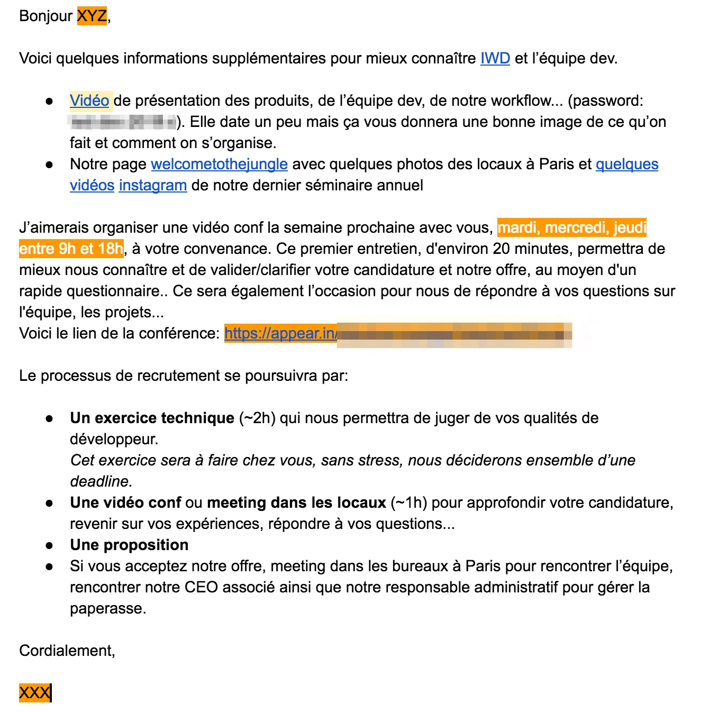
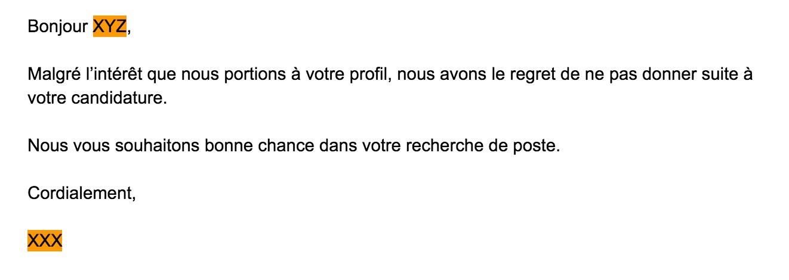

title: Recruter vos developpeurs
author:
  name: Fabien Furet
  twitter: RETFU
  url: http://fabienfuret.net
output: index.html
controls: true
style: assets/style.css
theme: sjaakvandenberg/cleaver-light

--

# Recruter vos **développeurs**
## Retour d'expérience

--

### Contexte IWD

* SaaS dans le merchandising/marketing, grand compte
* ~70 collaborateurs dont ~16 dans l'équipe dev 🚀
* Paris, New York, Singapour, Los Angeles, Bordeaux, Caen et Lyon
* Forte volonté d'augmenter les effectifs et particulièrement dans l'équipe dev 🚀
* Difficulté à attirer des talents:
  * Tout le monde cherche des devs
  * Grosse concurrence, surtout à Paris
  * [IWD](https://iwd.io) who?

--

# Objectifs

--

### Objectifs

* Pouvoir interagir avec plus de candidats
* Gagner du temps
* Être autonome (ne pas dépendre d'un cabinet ou de RH)
* Pouvoir déléguer à n'importe quelle étape du processus
* Ne pas être dépendant de moi
* Travailler/communiquer notre "image employeur" => [IWD](https://iwd.io) is a fucking place to work!!

--

# Processus

--

### Processus

* Annonce / Sourcing
* Premier contact par email
* **Vidéo conférence** (~20min)
* **Challenge technique** (~2h)
* Rencontre dans les bureaux de Paris (~1h)
* Proposition
* On boarding / fidélisation 😀

> `Tips` un budget dédié fait gagner du temps et comme le temps c'est de l'argent...

--

# L'annonce

--

### L'annonce 1/2

* On fait "transpirer" les **valeurs** de la société
* On est **honnête**, on ne cache pas le legacy 😅
* On donne un maximum de détails sur le **contexte** du job
* Pas de tutoiement
* Pas de mode *"kikool startup franglais t'as vu"*
* On donne systématiquement une fourchette pour le salaire ([Linkedin devinera de toute façon](https://siecledigital.fr/2018/02/14/lestimation-des-salaires-desormais-visible-sur-linkedin/))

--

### L'annonce 2/2

* La société
* L'équipe
* Les produits/services: leurs métiers, ce qu'ils résolvent, la stack technique...
* Infrastructure
* Pratique de l'équipe: mise en production, qualité, tests, codes reviews...
* Profil du candidat: ce qu'on recherche
* Exemple d'annonce: [Développeur web sénior](https://remixjobs.com/emploi/Developpeur-Web-Experimente-H-F-/42317)

--

# Sourcing

--

### Sourcing

Où trouve-t-on nos candidats?

* Jobboard type [Remixjob](https://remixjob.com) (~200€)
* Plateforme "de communication" [Welcome to the jungle 🤘](https://www.welcometothejungle.co) (~300€/mois)
* Plateforme qui "qualifie/filtre" [Talent.io](https://www.talent.io), [bluecoders](https://bluecoders.io) (~15% salaire brut annuel)
* ~~Recruteur dédié (>15% salaire brut annuel)~~

--

# 1er contact par email

--

### 1er contact par email 1/2

Phase d'accroche, de séduction 💕

* Lien vers une vidéo privée (~15min) de présentation de l'équipe, des produits...
* Quelques liens supplémentaires vers le site, Welcome to the jungle...
* On explique le processus de recrutement
* On sollicite une vidéo conf
* En fonction des candidats, on abordera les aspects remote, salaire, langue parlée...

--

### 1er contact par email 2/2

--

# Vidéo conférence

--

### Vidéo conférence 1/7

* On essaie de donner **confiance** au candidat
* On ne le prend pas de haut
* On est souriant, apaisé, **ouvert**
* **Pas de jugement** sur ses choix de "carrière" ou techniques
* C'est une **discussion** de dev entre dev
* On ne représente pas le contexte, la vidéo l'a déjà fait

--

### Vidéo conférence 2/7

* Faire rebondir par rapport à la vidéo: test, code review, continuous delivery
> **Que pourriez-vous proposer pour améliorer/aider l’équipe (process, outils...)?**  
> On cherche à connaître son expérience, ses pratiques, s'il voit déjà des améliorations (QA, A/B testing...)

--

### Vidéo conférence 3/7

* L'amener à parler de sa dernière expérience et à se projeter chez nous
> **Qu'est ce que vous aimez dans votre job actuel?**  
> L'équipe, les pratiques, la techno, le challenge...  
> **Ce qui vous plaît moins?**  
> Salaire, techno, stagnation, leadership...  
> **Pourquoi voulez-vous travailler chez nous?**  
> Pratiques, équipe, techno, impact, évolution, salaire...  

--

### Vidéo conférence 4/7

* Questions ouvertes, pas de réponses toutes faites
> **Comment organisez-vous votre veille technique?**  
> N'en fait pas, quotidienne, voir s'il se laisse vivre, ce qui l'intéresse en ce moment  
> **Dernier gros challenge technique?**  
> On creuse une expérience récente, on challenge ses choix, on voit s'il maîtrise son sujet  

--

### Vidéo conférence 5/7

* On ne juge pas, si pas de réponse, ce n'est pas grave, ce n'est pas un concours
> **Qu’est-ce qu’un bon code?**  
> Découplage, injection de dépendance, orienté métier ("DDD"), coding style, tests, maintenabilité, évolutivité, ...  
> **A quoi sert une Interface en POO?**  
> Définir un contrat, découplage, injection de dépendance, évolutivité...  
> **De quoi est composée une requête HTTP?**  
> Connaissance du protocole, http2  

--

### Vidéo conférence 6/7

* Mise en situation d'une problématique  
> **Comment gardez-vous une vision claire de votre prod?**  
> Logs, monitoring, Nagios, New Relics, ELK, alerting...   
> **Vous avez une grosse charge sur un service. Comment faites-vous pour la gérer?**  
> Cache applicatif et/ou http et/ou client, load balancer...  

--

### Vidéo conférence 7/7

* Plus spécifique aux technos, sans tomber dans la question de syntaxe
> **Avantages/inconvénients de la techno X**  
> Avoir du recul, connaître les forces/faiblesses, comparer à d'autres technos PHP vs Node  
> **Une/Deux questions spécifiques au language (Trait en PHP, this/Promise en JS)**  
> Connaissance des ajouts "récents" du language, concepts de base  
> **Questions sur l'ecosystem, les bonnes pratiques...**  
> Connaissance de la communauté, se tient à jour...  

--

# Arrêt du processus 😩

--

### Arrêt du processus 😩

#### Initié par le candidat
On répond de manière positive "bonne chance pour ton nouveau job"...  
Ne pas oublier de le sourcer.

#### Initié par nous
On est formel mais toujours positif.  
S'il vous demande pourquoi, soyez **franc et direct**.

> `Tips` ne jamais insulter l'avenir, on se recroisera peut-être

--

### Arrêt du processus 😩

--

# Challenge technique

--

### Challenge technique 1/2

* Fait à la **maison**
* Définir une **deadline** avec le candidat (10j s'il le faut)
* L'exercice est décrit avec le plus de **précision** possible, **autonomie**
* Les **objectifs** de l'exercice sont clairs
* **Rapide** à faire ~2h
* On décrit une vraie **problématique métier**, simplifiée
* [Notre challenge technique](https://github.com/iwonderanddev/tech-challenges)

> `Tips` prendre le temps d'itérer sur le challenge, ça vaut le coup de l'améliorer en fonction des retours
>
> `Tips` faire plusieurs challenges dérivés en fonction du profil junior/sénior ou backend/frontend

--

### Challenge technique 2/2

On a défini ce qu'on cherche à voir en amont:

* Le **métier** doit émerger dans le code
* Le **découplage**, des Interfaces pour contractualiser, injection de dépendances
* La **qualité**: tests, coding style...
* La **maintenabilité** du code sur le long terme
* Best practices: SOLID, KISS, YAGNI...

--

# Rencontre à Paris

--

### Rencontre à Paris

Dans 90% des cas, on a déjà très envie de recruter le candidat
* Visite des locaux
* Présentation des équipes sales 👯, client 🙆, dev 🚀...
* Répondre aux dernières interrogations
* Échanger avec des membres de l'équipe dev
* Rencontre avec le CEO
* Proposition formelle par écrit

> Si non Francilien, rembourse le billet de TGV

--

# Yeah mother fucker

--

### Yeah mother fucker 😁 🙌 ✌ 🚀 🌈 🎉 🎊

Le plus dur est fait.

* On prépare le **contrat** pour sécuriser l'embauche.
* On prévoît le **onboarding** et les 2 premières semaines: formations, setup, doc...
* ... ainsi que la **première US** qu'il attaquera au bout de max 3 jours.
* Pour le remote, 3j/semaine le premier mois sur Paris.  
  Très important pour s'imprégner de l'esprit de l'équipe, de son fonctionnement, de faire parti d'une aventure.

--

# Suivi

--

### Suivi

--

# Bilan

--

### Bilan

Sur la dernière année:
* ~70 candidats "étudiés"
* ~30 vidéos conférence
* ~20 challenges techniques
* 5 recrutements 🎉
* Actuellement 12 candidats dans le pipe pour 3 postes (2 devs + ops)

--

# Témoignage

--

### Damien Pobel, Lead developer

> Il est notre dernière recrue à Lyon. 🙏 ajoutez le sur twitter [@dpobel](https://twitter.com/dpobel) sinon je dois retirer cette slide

**Qu'est-ce qui t'a donné envie de répondre à ma sollicitation sur talent.io?**
> Le process de recrutement était **clair**. Le fait que ça se passe sur talent.io, la relation est un peu inversée et donc a priori si on est contacté ce que ça paraît coller côté recruteur.
La **vidéo** exprimait bien le **contexte** du job, de l'équipe et de la société.

**Qu'est-ce qui a fait que tu nous as dis oui 💒?**
> Le **bon contact** avec toi et l’équipe (il veut déjà une augmentation 😄), **prétention salariale** OK sans discussion, le **challenge technique** qui pose des questions pertinentes et qui m’ont permis d’avoir un bon aperçu de où j’allais. Enfin l’aspect **remote** tout en ayant des collègues à Lyon, le meilleur des 2 mondes en gros 🎉.

--

# Merci
 
## Relecture, critiques, pull requests 😉
## [@mbagur](https://twitter.com/mbagur) [@mikael_letang](https://twitter.com/mikael_letang) [@dpobel](https://twitter.com/dpobel)

--

# Questions?
